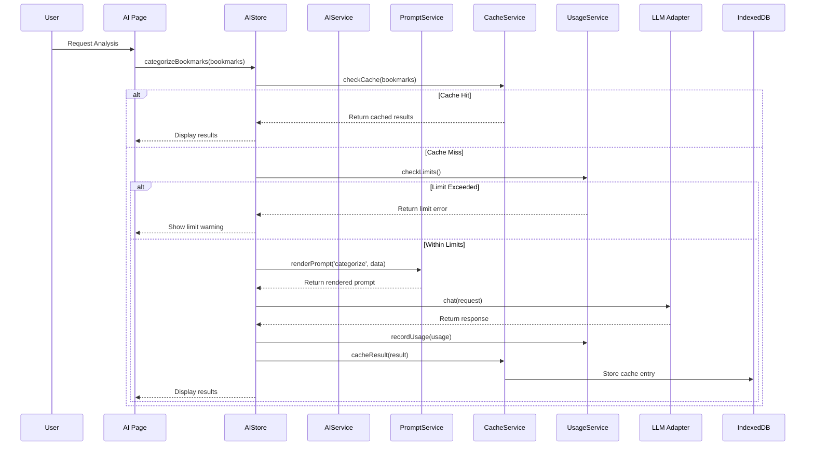
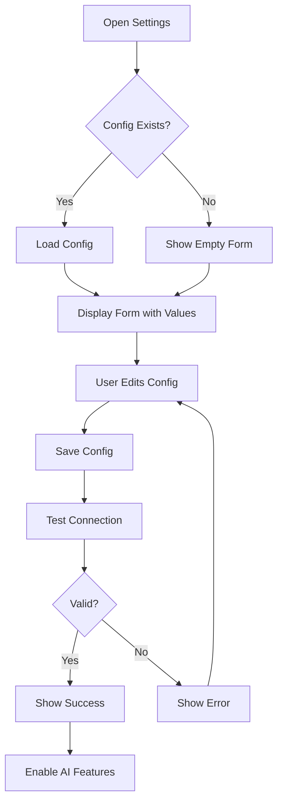

# Design Document: AI Bookmark Analysis

## Overview

本设计文档描述了浏览器书签管理系统的 AI 智能分析功能的技术架构和实现方案。系统采用 Local-first 架构，通过客户端直接调用 LLM API 实现智能分析，所有数据和配置存储在本地 IndexedDB 中。

### 设计原则

1. **隐私优先**: 书签数据仅在本地处理，API 调用时只发送必要的文本信息
2. **成本可控**: 批量处理、缓存机制、用量监控
3. **渐进增强**: AI 功能作为可选增强，不影响核心书签管理功能
4. **多提供商支持**: 抽象 API 层，支持多种 LLM 提供商

## Architecture

```
┌─────────────────────────────────────────────────────────────────┐
│                        UI Layer (React)                         │
│  ┌──────────┐ ┌──────────┐ ┌──────────┐ ┌──────────────────┐   │
│  │ AI Page  │ │ Settings │ │ Search   │ │ Analysis Report  │   │
│  └────┬─────┘ └────┬─────┘ └────┬─────┘ └────────┬─────────┘   │
└───────┼────────────┼────────────┼────────────────┼─────────────┘
        │            │            │                │
┌───────┴────────────┴────────────┴────────────────┴─────────────┐
│                    State Layer (Zustand)                        │
│  ┌─────────────────────────────────────────────────────────┐   │
│  │              useAIStore                                  │   │
│  │  - config (provider, apiKey, model)                     │   │
│  │  - usage (tokens, cost)                                 │   │
│  │  - cache (analysis results)                             │   │
│  │  - prompts (templates)                                  │   │
│  └─────────────────────────────────────────────────────────┘   │
└────────────────────────────┬───────────────────────────────────┘
                             │
┌────────────────────────────┴───────────────────────────────────┐
│                    Service Layer                                │
│  ┌──────────────┐ ┌──────────────┐ ┌──────────────────────┐    │
│  │ AIService    │ │ PromptService│ │ CacheService         │    │
│  │ - analyze()  │ │ - render()   │ │ - get/set/clear()    │    │
│  │ - categorize │ │ - validate() │ │ - isExpired()        │    │
│  │ - summarize  │ │              │ │                      │    │
│  └──────┬───────┘ └──────────────┘ └──────────────────────┘    │
│         │                                                       │
│  ┌──────┴───────────────────────────────────────────────────┐  │
│  │                  LLM Provider Adapter                     │  │
│  │  ┌─────────┐ ┌─────────┐ ┌─────────┐ ┌─────────────────┐ │  │
│  │  │ OpenAI  │ │ Claude  │ │ Custom  │ │ (Future: Local) │ │  │
│  │  └─────────┘ └─────────┘ └─────────┘ └─────────────────┘ │  │
│  └──────────────────────────────────────────────────────────┘  │
└────────────────────────────┬───────────────────────────────────┘
                             │
┌────────────────────────────┴───────────────────────────────────┐
│                    Storage Layer (IndexedDB/Dexie)              │
│  ┌──────────────┐ ┌──────────────┐ ┌──────────────────────┐    │
│  │ ai_config    │ │ ai_cache     │ │ ai_usage             │    │
│  │ ai_prompts   │ │              │ │                      │    │
│  └──────────────┘ └──────────────┘ └──────────────────────┘    │
└────────────────────────────────────────────────────────────────┘
```

## Components and Interfaces

### 1. LLM Provider Adapter

抽象的 LLM 提供商接口，支持多种 API 提供商。

```typescript
// src/ai/types.ts
interface LLMProvider {
  name: string;
  models: string[];
  defaultModel: string;
  baseUrl: string;
}

interface LLMConfig {
  provider: 'openai' | 'claude' | 'custom';
  apiKey: string;
  model: string;
  baseUrl?: string;  // for custom provider
  maxTokens?: number;
  temperature?: number;
}

interface LLMRequest {
  messages: Array<{
    role: 'system' | 'user' | 'assistant';
    content: string;
  }>;
  maxTokens?: number;
  temperature?: number;
}

interface LLMResponse {
  content: string;
  usage: {
    promptTokens: number;
    completionTokens: number;
    totalTokens: number;
  };
  model: string;
}

interface LLMAdapter {
  chat(request: LLMRequest): Promise<LLMResponse>;
  validateApiKey(): Promise<boolean>;
  estimateCost(tokens: number): number;
}
```

### 2. AI Service

核心 AI 分析服务，提供各种分析功能。

```typescript
// src/ai/aiService.ts
interface CategorySuggestion {
  bookmarkId: string;
  suggestedCategory: string;
  confidence: number;
  reasoning: string;
}

interface BookmarkSummary {
  bookmarkId: string;
  summary: string;
  keywords: string[];
  generatedAt: number;
}

interface DuplicateRecommendation {
  groupId: string;
  keepBookmarkId: string;
  reasoning: string;
  factors: string[];
}

interface HealthIssue {
  bookmarkId: string;
  issueType: 'outdated' | 'low_value' | 'broken_pattern' | 'redundant';
  description: string;
  suggestion: string;
  dismissed: boolean;
}

interface CollectionReport {
  generatedAt: number;
  totalBookmarks: number;
  categoryDistribution: Record<string, number>;
  domainPatterns: Array<{ domain: string; count: number }>;
  timelineTrends: Array<{ period: string; count: number }>;
  recommendations: string[];
  insights: string[];
}

interface AIService {
  // 分类
  categorizeBookmarks(bookmarks: Bookmark[]): Promise<CategorySuggestion[]>;
  
  // 摘要
  summarizeBookmark(bookmark: Bookmark): Promise<BookmarkSummary>;
  summarizeBookmarks(bookmarks: Bookmark[]): Promise<BookmarkSummary[]>;
  
  // 重复分析
  analyzeDuplicates(duplicateGroups: Bookmark[][]): Promise<DuplicateRecommendation[]>;
  
  // 健康检查
  analyzeHealth(bookmarks: Bookmark[]): Promise<HealthIssue[]>;
  
  // 自然语言搜索
  interpretQuery(query: string, bookmarks: Bookmark[]): Promise<string[]>;
  
  // 集合报告
  generateReport(bookmarks: Bookmark[]): Promise<CollectionReport>;
}
```

### 3. Prompt Service

提示词模板管理服务。

```typescript
// src/ai/promptService.ts
interface PromptTemplate {
  id: string;
  name: string;
  description: string;
  template: string;
  variables: string[];
  isDefault: boolean;
  createdAt: number;
  updatedAt: number;
}

interface PromptService {
  getTemplate(id: string): Promise<PromptTemplate | null>;
  getAllTemplates(): Promise<PromptTemplate[]>;
  saveTemplate(template: PromptTemplate): Promise<void>;
  resetTemplate(id: string): Promise<void>;
  renderPrompt(templateId: string, variables: Record<string, string>): Promise<string>;
}
```

### 4. Cache Service

AI 分析结果缓存服务。

```typescript
// src/ai/cacheService.ts
interface CacheEntry<T> {
  key: string;
  value: T;
  createdAt: number;
  expiresAt: number;
  bookmarkHash: string;  // 用于检测书签变化
}

interface CacheService {
  get<T>(key: string): Promise<T | null>;
  set<T>(key: string, value: T, ttlMs?: number): Promise<void>;
  has(key: string): Promise<boolean>;
  delete(key: string): Promise<void>;
  clear(): Promise<void>;
  getStats(): Promise<{ entries: number; sizeBytes: number }>;
}
```

### 5. Usage Tracking Service

API 使用量追踪服务。

```typescript
// src/ai/usageService.ts
interface UsageRecord {
  id: string;
  timestamp: number;
  operation: string;
  promptTokens: number;
  completionTokens: number;
  totalTokens: number;
  estimatedCost: number;
  model: string;
}

interface UsageStats {
  totalTokens: number;
  totalCost: number;
  operationBreakdown: Record<string, { tokens: number; cost: number }>;
  dailyUsage: Array<{ date: string; tokens: number; cost: number }>;
}

interface UsageLimits {
  dailyTokenLimit?: number;
  monthlyTokenLimit?: number;
  dailyCostLimit?: number;
  monthlyCostLimit?: number;
}

interface UsageService {
  recordUsage(record: Omit<UsageRecord, 'id'>): Promise<void>;
  getStats(startDate?: Date, endDate?: Date): Promise<UsageStats>;
  getLimits(): Promise<UsageLimits>;
  setLimits(limits: UsageLimits): Promise<void>;
  checkLimits(): Promise<{ exceeded: boolean; message?: string }>;
  clearHistory(): Promise<void>;
}
```

### 6. AI Store (Zustand)

AI 功能的全局状态管理。

```typescript
// src/store/useAIStore.ts
interface AIState {
  // 配置
  config: LLMConfig | null;
  isConfigured: boolean;
  
  // 连接状态
  connectionStatus: 'idle' | 'testing' | 'connected' | 'error';
  connectionError: string | null;
  
  // 操作状态
  isProcessing: boolean;
  currentOperation: string | null;
  progress: { current: number; total: number } | null;
  
  // 缓存的分析结果
  categorySuggestions: Map<string, CategorySuggestion>;
  summaries: Map<string, BookmarkSummary>;
  duplicateRecommendations: DuplicateRecommendation[];
  healthIssues: HealthIssue[];
  latestReport: CollectionReport | null;
  
  // 使用统计
  usageStats: UsageStats | null;
  usageLimits: UsageLimits;
  
  // Actions
  setConfig(config: LLMConfig): Promise<void>;
  testConnection(): Promise<boolean>;
  categorizeBookmarks(bookmarks: Bookmark[]): Promise<void>;
  summarizeBookmarks(bookmarks: Bookmark[]): Promise<void>;
  analyzeDuplicates(groups: Bookmark[][]): Promise<void>;
  analyzeHealth(bookmarks: Bookmark[]): Promise<void>;
  searchWithAI(query: string, bookmarks: Bookmark[]): Promise<string[]>;
  generateReport(bookmarks: Bookmark[]): Promise<void>;
  dismissHealthIssue(bookmarkId: string): Promise<void>;
  refreshUsageStats(): Promise<void>;
}
```

## Data Models

### IndexedDB Schema Extensions

```typescript
// src/utils/db.ts (扩展)
interface AIConfig {
  id: 'default';
  provider: 'openai' | 'claude' | 'custom';
  apiKey: string;  // 加密存储
  model: string;
  baseUrl?: string;
  maxTokens: number;
  temperature: number;
  updatedAt: number;
}

interface AICache {
  id: string;  // `${type}:${bookmarkId}` or `${type}:${hash}`
  type: 'category' | 'summary' | 'duplicate' | 'health' | 'report';
  data: unknown;
  bookmarkHash: string;
  createdAt: number;
  expiresAt: number;
}

interface AIUsage {
  id: string;
  timestamp: number;
  operation: string;
  promptTokens: number;
  completionTokens: number;
  totalTokens: number;
  estimatedCost: number;
  model: string;
}

interface AIPrompt {
  id: string;
  name: string;
  description: string;
  template: string;
  variables: string[];
  isDefault: boolean;
  isCustomized: boolean;
  createdAt: number;
  updatedAt: number;
}

interface AIUsageLimits {
  id: 'default';
  dailyTokenLimit?: number;
  monthlyTokenLimit?: number;
  dailyCostLimit?: number;
  monthlyCostLimit?: number;
  updatedAt: number;
}

// Dexie schema version upgrade
db.version(2).stores({
  bookmarks: '++id, url, normalized, title, addDate, sourceFile',
  settings: 'id',
  // New AI tables
  aiConfig: 'id',
  aiCache: 'id, type, expiresAt',
  aiUsage: '++id, timestamp, operation',
  aiPrompts: 'id, isDefault',
  aiUsageLimits: 'id'
});
```

### Default Prompt Templates

```typescript
const DEFAULT_PROMPTS: PromptTemplate[] = [
  {
    id: 'categorize',
    name: '书签分类',
    description: '为书签建议合适的分类',
    template: `分析以下书签并为每个建议一个分类。

书签列表:
{{bookmarks}}

请为每个书签返回 JSON 格式的分类建议:
{
  "suggestions": [
    {
      "bookmarkId": "id",
      "category": "建议的分类",
      "confidence": 0.0-1.0,
      "reasoning": "分类理由"
    }
  ]
}

分类应该简洁明了，如：技术/编程、新闻/资讯、工具/效率、学习/教程、娱乐/视频等。`,
    variables: ['bookmarks'],
    isDefault: true
  },
  {
    id: 'summarize',
    name: '书签摘要',
    description: '生成书签内容的简短描述',
    template: `根据以下书签的标题和 URL，生成一个简短的内容描述。

标题: {{title}}
URL: {{url}}
路径: {{path}}

请返回 JSON 格式:
{
  "summary": "50字以内的内容描述",
  "keywords": ["关键词1", "关键词2", "关键词3"]
}`,
    variables: ['title', 'url', 'path'],
    isDefault: true
  },
  {
    id: 'duplicate_analysis',
    name: '重复分析',
    description: '分析重复书签并推荐保留项',
    template: `分析以下重复书签组，推荐应该保留哪一个。

重复书签组:
{{duplicates}}

请返回 JSON 格式:
{
  "keepId": "推荐保留的书签ID",
  "reasoning": "推荐理由",
  "factors": ["考虑因素1", "考虑因素2"]
}

考虑因素包括：标题质量、URL 结构、添加时间、文件夹位置等。`,
    variables: ['duplicates'],
    isDefault: true
  },
  {
    id: 'health_check',
    name: '健康检查',
    description: '识别可能有问题的书签',
    template: `分析以下书签，识别可能过时、低价值或有问题的书签。

书签列表:
{{bookmarks}}

请返回 JSON 格式:
{
  "issues": [
    {
      "bookmarkId": "id",
      "issueType": "outdated|low_value|broken_pattern|redundant",
      "description": "问题描述",
      "suggestion": "建议操作"
    }
  ]
}`,
    variables: ['bookmarks'],
    isDefault: true
  },
  {
    id: 'natural_search',
    name: '自然语言搜索',
    description: '解释用户的搜索意图',
    template: `用户想要搜索书签，查询内容是: "{{query}}"

可用的书签信息:
{{bookmarks}}

请理解用户的搜索意图，返回最相关的书签 ID 列表:
{
  "matchedIds": ["id1", "id2", ...],
  "interpretation": "对用户查询的理解"
}`,
    variables: ['query', 'bookmarks'],
    isDefault: true
  },
  {
    id: 'collection_report',
    name: '集合报告',
    description: '生成书签集合的分析报告',
    template: `分析以下书签集合，生成一份洞察报告。

统计信息:
- 总数: {{totalCount}}
- 域名分布: {{domainStats}}
- 时间分布: {{timeStats}}
- 目录结构: {{folderStats}}

请返回 JSON 格式的分析报告:
{
  "insights": ["洞察1", "洞察2", ...],
  "recommendations": ["建议1", "建议2", ...],
  "highlights": {
    "mostVisitedDomains": [...],
    "growthTrend": "描述",
    "organizationScore": 0-100
  }
}`,
    variables: ['totalCount', 'domainStats', 'timeStats', 'folderStats'],
    isDefault: true
  }
];
```

## Correctness Properties

*A property is a characteristic or behavior that should hold true across all valid executions of a system-essentially, a formal statement about what the system should do. Properties serve as the bridge between human-readable specifications and machine-verifiable correctness guarantees.*


### Property 1: Configuration Round-Trip

*For any* valid LLM configuration (provider, apiKey, model, baseUrl), saving the configuration to IndexedDB and then loading it should return an equivalent configuration object.

**Validates: Requirements 1.2, 1.6**

### Property 2: Provider Adapter Validity

*For any* supported provider type (openai, claude, custom), the LLM adapter should correctly construct API requests according to that provider's specification.

**Validates: Requirements 1.5**

### Property 3: Invalid API Key Error Handling

*For any* API key that fails validation (empty, malformed, or rejected by provider), the system should return an error object with a descriptive message rather than throwing an unhandled exception.

**Validates: Requirements 1.4**

### Property 4: Categorization Output Validity

*For any* non-empty list of bookmarks, the categorization function should return a list of CategorySuggestion objects where each suggestion references a valid bookmark ID from the input and has a confidence score between 0 and 1.

**Validates: Requirements 2.1**

### Property 5: Category Acceptance Updates Bookmark

*For any* bookmark and accepted category suggestion, applying the category should result in the bookmark's category field being updated to match the suggestion.

**Validates: Requirements 2.3**

### Property 6: Batch Processing Efficiency

*For any* list of N bookmarks and batch size B, the number of API calls made during categorization should be at most ceil(N/B).

**Validates: Requirements 2.5**

### Property 7: Summary Generation Validity

*For any* bookmark with a non-empty title and valid URL, the summary function should return a BookmarkSummary object with a non-empty summary string and a keywords array.

**Validates: Requirements 3.1**

### Property 8: Summary Storage Round-Trip

*For any* generated BookmarkSummary, storing it and then retrieving it by bookmark ID should return an equivalent summary object.

**Validates: Requirements 3.2**

### Property 9: Summary Fallback on Error

*For any* bookmark where summary generation fails (API error, timeout, invalid response), the system should return a fallback summary object with a default message rather than throwing.

**Validates: Requirements 3.4**

### Property 10: Rate Limit Compliance

*For any* sequence of API calls within a time window, the system should not exceed the configured rate limit, implementing delays or queuing as necessary.

**Validates: Requirements 3.5**

### Property 11: Duplicate Recommendation Validity

*For any* duplicate group containing at least 2 bookmarks, the recommendation should reference a keepBookmarkId that exists in the group and include a non-empty reasoning string.

**Validates: Requirements 4.1, 4.2**

### Property 12: Recommendation Acceptance Updates Keeper

*For any* duplicate group and accepted recommendation, the recommended bookmark should be marked as the keeper and other bookmarks in the group should be marked as duplicates.

**Validates: Requirements 4.4**

### Property 13: Health Analysis Validity

*For any* list of bookmarks, health analysis should return a list of HealthIssue objects where each issue references a valid bookmark ID, has a valid issueType, and includes a non-empty suggestion.

**Validates: Requirements 5.1, 5.3**

### Property 14: Health Dismissal Persistence

*For any* dismissed health issue, the dismissal state should persist across page reloads and the issue should not reappear in subsequent health analyses.

**Validates: Requirements 5.4**

### Property 15: Query Interpretation Validity

*For any* non-empty natural language query string, the interpreter should return a valid interpretation object without throwing.

**Validates: Requirements 6.1**

### Property 16: Search Result Validity

*For any* interpreted query and bookmark set, all returned bookmark IDs should exist in the original bookmark set.

**Validates: Requirements 6.2**

### Property 17: Empty Search Suggestions

*For any* query that returns zero results, the system should provide at least one alternative search suggestion.

**Validates: Requirements 6.4**

### Property 18: Report Structure Validity

*For any* non-empty bookmark collection, the generated report should contain all required fields: generatedAt timestamp, totalBookmarks count, categoryDistribution, domainPatterns, timelineTrends, recommendations array, and insights array.

**Validates: Requirements 7.1, 7.2, 7.3, 7.4**

### Property 19: Report Export Validity

*For any* CollectionReport, exporting to Markdown should produce a valid Markdown string that can be parsed, and exporting to HTML should produce valid HTML.

**Validates: Requirements 7.5**

### Property 20: Prompt Template Round-Trip

*For any* prompt template edit (changing template text or variables), saving and then loading the template should return the edited version.

**Validates: Requirements 8.2**

### Property 21: Prompt Template Reset

*For any* customized prompt template, resetting it should restore the original default template content.

**Validates: Requirements 8.3**

### Property 22: Prompt Variable Substitution

*For any* prompt template with N variables and a data object containing all N variable values, rendering the prompt should replace all {{variable}} placeholders with their corresponding values.

**Validates: Requirements 8.5**

### Property 23: Usage Tracking Round-Trip

*For any* API call that completes, a usage record should be created and persisted, and the record should be retrievable after page reload.

**Validates: Requirements 9.1, 9.5**

### Property 24: Usage Limit Warning

*For any* usage that reaches 80% of a configured limit, the system should trigger a warning notification.

**Validates: Requirements 9.3**

### Property 25: Usage Limit Blocking

*For any* AI operation attempted when usage has reached 100% of a configured limit, the operation should be blocked and return an error indicating the limit has been reached.

**Validates: Requirements 9.4**

### Property 26: Cache Round-Trip

*For any* AI analysis result, caching it and then requesting the same analysis should return the cached result without making a new API call.

**Validates: Requirements 10.1, 10.2**

### Property 27: Cache Bypass on Force Refresh

*For any* cached analysis, requesting a fresh analysis with force-refresh flag should bypass the cache and make a new API call.

**Validates: Requirements 10.4**

### Property 28: Cache Management Operations

*For any* cache state, clearing the cache should result in an empty cache, and setting cache duration should affect expiration of new entries.

**Validates: Requirements 10.5**

## Error Handling

### API Errors

```typescript
enum AIErrorCode {
  INVALID_API_KEY = 'INVALID_API_KEY',
  RATE_LIMITED = 'RATE_LIMITED',
  QUOTA_EXCEEDED = 'QUOTA_EXCEEDED',
  NETWORK_ERROR = 'NETWORK_ERROR',
  INVALID_RESPONSE = 'INVALID_RESPONSE',
  USAGE_LIMIT_REACHED = 'USAGE_LIMIT_REACHED',
  PROVIDER_ERROR = 'PROVIDER_ERROR'
}

interface AIError {
  code: AIErrorCode;
  message: string;
  retryable: boolean;
  retryAfterMs?: number;
}
```

### Error Handling Strategy

1. **Network Errors**: 自动重试最多 3 次，指数退避
2. **Rate Limiting**: 等待 retryAfter 时间后重试
3. **Invalid API Key**: 立即失败，提示用户检查配置
4. **Usage Limit**: 阻止操作，显示用量统计
5. **Invalid Response**: 记录日志，返回 fallback 结果

### Fallback Behaviors

| 操作 | Fallback 行为 |
|------|--------------|
| 分类 | 返回 "未分类" 建议 |
| 摘要 | 返回 "无法生成摘要" |
| 重复分析 | 使用默认规则（保留最早的） |
| 健康检查 | 返回空问题列表 |
| 自然语言搜索 | 降级为关键词搜索 |
| 报告生成 | 返回基础统计报告 |

## Testing Strategy

### Unit Tests

单元测试覆盖核心逻辑：

1. **LLM Adapter Tests**
   - 各提供商的请求构造
   - 响应解析
   - 错误处理

2. **Prompt Service Tests**
   - 模板渲染
   - 变量替换
   - 默认模板加载

3. **Cache Service Tests**
   - 缓存存取
   - 过期检测
   - 清理操作

4. **Usage Service Tests**
   - 用量记录
   - 统计计算
   - 限额检查

### Property-Based Tests

使用 fast-check 进行属性测试，每个测试运行至少 100 次迭代。

```typescript
// 测试框架配置
import fc from 'fast-check';

// 每个属性测试的配置
const PBT_CONFIG = {
  numRuns: 100,
  verbose: true
};
```

测试标注格式：
```typescript
// Feature: ai-bookmark-analysis, Property 1: Configuration Round-Trip
// Validates: Requirements 1.2, 1.6
```

### Integration Tests

1. **API 集成测试**（使用 mock server）
   - 完整的分类流程
   - 批量处理
   - 错误恢复

2. **存储集成测试**
   - IndexedDB 读写
   - 数据迁移
   - 并发访问

### Test Data Generators

```typescript
// 书签生成器
const bookmarkArb = fc.record({
  id: fc.uuid(),
  title: fc.string({ minLength: 1, maxLength: 200 }),
  url: fc.webUrl(),
  path: fc.array(fc.string({ minLength: 1, maxLength: 50 }), { maxLength: 5 }),
  addDate: fc.integer({ min: 0, max: Date.now() / 1000 })
});

// LLM 配置生成器
const llmConfigArb = fc.record({
  provider: fc.constantFrom('openai', 'claude', 'custom'),
  apiKey: fc.string({ minLength: 10, maxLength: 100 }),
  model: fc.string({ minLength: 1, maxLength: 50 }),
  baseUrl: fc.option(fc.webUrl()),
  maxTokens: fc.integer({ min: 100, max: 4000 }),
  temperature: fc.float({ min: 0, max: 2 })
});

// 提示词模板生成器
const promptTemplateArb = fc.record({
  id: fc.string({ minLength: 1, maxLength: 50 }),
  name: fc.string({ minLength: 1, maxLength: 100 }),
  template: fc.string({ minLength: 10, maxLength: 2000 }),
  variables: fc.array(fc.string({ minLength: 1, maxLength: 30 }), { maxLength: 10 })
});
```

## Mermaid Diagrams

### AI Analysis Flow



### Configuration Flow


